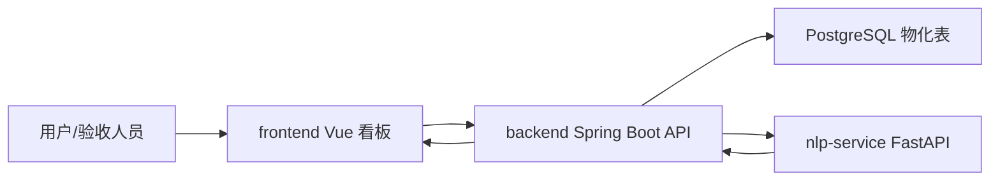

> generated_by: nexus-mapper v2
> verified_at: 2026-06-03
> provenance: AST-backed for Java/TypeScript/Python/JavaScript; Vue and SQL are module-only, so component/schema details are partly inferred from manual inspection and tests.

# Review Analyzer Knowledge Map

## 一句话定位

这是一个蓝牙耳机评论分析与产品改进决策系统。当前主线是：初始化受控演示评论 -> 后端触发分析任务 -> NLP 服务或后端规则识别方面/情感 -> 后端物化问题和指标 -> 前端展示问题、对比、趋势、词云、动作、验证和 showcase 运行态。

## 主模块口径

主项目建议按 5 个模块讲：

- `frontend/`：Vue 3 + TypeScript 单页看板，负责登录门禁、模块导航、状态提示、图表和接口数据归一化。
- `backend/`：Spring Boot + Java 21 REST API，负责业务主流程、任务状态、数据物化、查询聚合、动作验证。
- `nlp-service/`：FastAPI + Pydantic 服务，负责基于关键词规则的方面识别、情感识别、置信度和问题簇。
- `infra/`：Docker Compose + PostgreSQL 初始化 SQL + Redis，负责运行环境和数据表结构。
- `docs/`：报告、接口文档、代码文档、需求图，用于验收和答辩材料。

`legacy/`、`wh/`、`.tmp/` 不建议算入主模块：它们更像旧版本源码、历史参考和临时产物。答辩时可以说明“主交付链路不依赖这些目录”。

## 当前完成度

前端测试已通过：`npm --prefix frontend test`，13 个测试文件、45 个测试通过。

NLP 测试已通过：`python -m pytest nlp-service/tests -q`，8 个测试通过。

后端测试未在本机完成：`mvn` 命令不可用，当前机器没有 Maven CLI 或 PATH 未配置。后端已有 `ApiSmokeTest`、`PersistenceIntegrationTest`、`AnalysisJobServiceTest`、`InsightQueryServiceTest`、`SyncJobServiceTest`，下一步应使用 Maven Wrapper、IDE Maven 或 Docker 补跑。

## 最重要的数据流

## 重构优先级

第一优先级不是大改算法，而是稳定验收链路：`demo-data/init` -> `analysis/start` -> `issues/compare/trends/wordcloud/actions/validation/showcase`。Git 热点显示近期最活跃的是 `frontend/src/App.vue`、`frontend/src/api/client.ts`、登录组件、前端测试和后端 smoke/integration 测试，说明风险集中在前端壳层和 API 合同。

第二优先级是清理模块边界：把 `legacy/`、`wh/`、`.tmp/` 从报告口径中剥离，必要时加入 `.gitignore` 或移动到归档说明里，避免验收时被误认为未完成主功能。

第三优先级是补后端可运行验证：先解决 Maven 执行方式，再跑后端测试和 Docker Compose 启动检查。

## [操作指南] 强制执行步骤

> 本节是对所有读取本文件的 AI 发出的硬性操作指令，不是建议。

### 步骤1 — 必须先读完以下所有文件（顺序不限）

读完本文件后，在执行任何任务之前，必须依次 read 以下文件完整内容：

- `.nexus-map/arch/systems.md` — 系统边界与代码位置
- `.nexus-map/arch/dependencies.md` — 系统间依赖关系与 Mermaid 图
- `.nexus-map/arch/test_coverage.md` — 测试面与证据缺口
- `.nexus-map/hotspots/git_forensics.md` — Git 热点与耦合风险
- `.nexus-map/concepts/domains.md` — 核心领域概念

> 这些文件均为高密度摘要，总量通常 < 5000 tokens，是必要的上下文成本。
> 不得以"任务简单"或"只改一个文件"为由跳过。

### 步骤2 — 按任务类型追加操作（步骤1 完成后执行）

- 若任务涉及**接口修改、新增跨模块调用、删除/重命名公共函数**：
  → 必须运行 `query_graph.py --impact <目标文件>` 确认影响半径后再写代码。
- 若任务需要**判断某文件被谁引用**：
  → 运行 `query_graph.py --who-imports <模块名>`。
- 若仓库结构已发生重大变化（新增系统、重构模块边界）：
  → 任务完成后评估是否需要重新运行 nexus-mapper 更新知识库。
