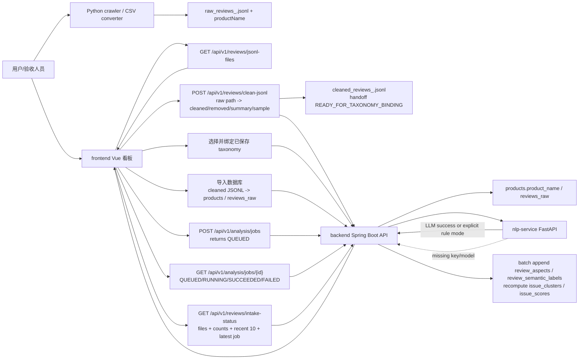

> generated_by: nexus-mapper v2
> verified_at: 2026-06-04
> provenance: AST-backed for Java/TypeScript/Python/JavaScript; Vue and SQL are module-only, so component/schema details are partly inferred from manual inspection and tests.

# Review Analyzer Knowledge Map

## 一句话定位

这是一个电商评论 VOC 分析与产品改进决策系统。当前主线是：终端采集或 CSV 转换评论 -> 保存带 `productName` 的 raw JSONL -> 后端清洗 raw JSONL 并输出 cleaned/removed/summary/sample -> 在左侧独立 taxonomy 模块编辑并保存标签体系 -> 数据接入页从“商品品类”下拉框选择已保存 taxonomy 并绑定商品 -> 导入数据库 -> 启动异步 LLM 分析任务并轮询真实批次进度 -> 每批 LLM 返回后立即追加物化问题和指标 -> 前端展示数据接入、问题、卖点、竞品对比、趋势图、带词性/词类的词云和前后对比。`POST /api/v1/reviews/clean-jsonl` 只做清洗，不写 `products`、`reviews_raw`、`sync_jobs` 或 `data_quality_runs`，返回 handoff `READY_FOR_TAXONOMY_BINDING`。当前前端只有在 cleaned 文件实际存在且用户执行导入动作时才用 cleaned JSONL 导入，并向 `POST /api/v1/reviews/import-jsonl` 传 `replaceExisting=true` 覆盖旧 `reviews_raw` 和旧物化输出，避免图表继续读取未清洗评论；如果同商品仍有 `QUEUED`/`RUNNING` 的 LLM 分析任务，后端会拒绝覆盖导入，防止删除正在分析的评论 ID。启动 LLM 分析时，如果 `intake-status` 已显示数据库有评论，前端会复用现有 `reviews_raw`，不会为了启动分析再次覆盖导入 cleaned JSONL。`GET /api/v1/reviews/intake-status` 是刷新页面后的流程台账接口，会返回 raw/cleaned 文件存在性、清洗摘要、taxonomy 绑定状态、入库/已分析数量、`downstreamReady`、最新 LLM job 和默认最近 10 条评论。分析任务开始时会清空该商品旧物化输出；每批写入 `review_aspects` 和 `review_semantic_labels` 前会校验待写入的 `review_id` 仍属于当前商品；如果分析期间评论被重新导入或替换，任务会失败并提示重新启动分析，而不是抛数据库外键错误。每批写入后会更新 `materializedReviewCount`、`downstreamReady` 和当前阶段，前端一旦看到物化条数增长就刷新问题、卖点、趋势和词云；如果用户曾打开空态的下游模块，重新切回问题、卖点、趋势或词云时会再次拉取接口，避免停留在旧空态。未配置 LLM key/model 时，NLP 服务不再生成规则 fallback 结果，后端会把分析任务标记为失败并阻止假结果物化；只有显式 `NLP_FORCE_LOCAL=true` 才进入规则演示模式。当前代码没有找到 `/api/v1/demo-data/init` controller，验收应优先使用 JSONL 清洗/导入/分析链路。

## 主模块口径

主项目建议按 4 个运行模块讲：

- `frontend/`：Vue 3 + TypeScript 单页看板，负责登录门禁、模块导航、状态提示、图表和接口数据归一化。当前主导航只保留后端有计算数据支撑的模块：数据接入、taxonomy、问题、卖点、竞品分析/对比、趋势图、词云、前后对比。独立 `taxonomy` 模块用 `TaxonomyManagerPanel` 编辑和保存可复用 taxonomy；保存后，数据接入页的“商品品类”下拉框会多出该 taxonomy。数据接入页 `ProductSetupPanel` 已拆成页内四步：`JSONL`、`taxonomy`、`导入分析`、`状态评论`，不会新增整页滚动条；长内容只在局部 `scroll-region` 内滚动。顶部“商品品类”不再是自由输入，而是从 `GET /api/v1/taxonomies` 读取已有 taxonomy 后下拉选择；`taxonomy` 步骤只用 `UxTaxonomyTree` 只读预览当前标签体系并执行“绑定当前 taxonomy”，不再在数据接入页内编辑 UX 一级/二级标签。页面通过 `fetchReviewIntakeStatus` 恢复每一步持久化状态，通过 `fetchAnalysisJob` 轮询异步分析任务，显示真实 `processedReviewCount/totalReviewCount/progressPercent/currentStage` 和默认最近 10 条评论。前端会区分“LLM 任务结束”和“下游图表数据已写入”：`downstreamReady=true` 或物化计数增长时就触发全局下游刷新，不再等全部 LLM 批次结束；启动分析会复用已入库评论，只有显式导入才覆盖 cleaned JSONL；问题/卖点/趋势/词云模块从空态或错误态重新进入时会重新请求，避免显示旧空态。趋势图读取当前商品 taxonomy 的启用 UX 二级标签，逐个请求 `/trends` 并在同一个面板中用多色折线展示，点击图例或点位可高亮对应维度。`frontend/src/api/client.ts` 的默认后端地址不再硬编码 `localhost`，空 `VITE_API_BASE_URL` 时会按当前浏览器 `protocol/hostname` 推导 `:8080`。词云展示词频、情绪、词性和业务词类；后端已按负向痛点和正向认可分桶返回，避免正评高频词淹没负面 VOC。界面风格已收敛为纯白极简风格。
- `backend/`：Spring Boot + Java 21 REST API，负责业务主流程、任务状态、本地 JSONL 清洗、数据库导入、同步/异步分析、数据物化、查询聚合、竞品 taxonomy 校验、前后时间窗口对比。
- `nlp-service/`：FastAPI + Pydantic 服务，负责 OpenAI-compatible LLM 评论语义分析；未配置 `OPENAI_API_KEY`/`OPENAI_MODEL` 或 `LLM_API_KEY`/`LLM_MODEL` 时返回明确配置错误，不再自动 fallback。显式 `NLP_FORCE_LOCAL=true` 时才启用规则演示模式。
- `crawler/`：Python + DrissionPage/FastAPI 浏览器辅助采集服务，负责合规监听用户正常浏览产生的评论数据，并写入 `crawler/output/raw_reviews_<productCode>.jsonl`。
- `pipeline/`：Python JSONL 清洗脚本，保留命令行清洗能力；后端也内置了等价清洗导入能力供前端按钮调用。
- `infra/`：Docker Compose + PostgreSQL 初始化 SQL + Redis，负责运行环境和数据表结构。

`docs/` 和 `README.md` 不再作为默认维护对象；后续 AI 默认只维护 `.nexus-map/`。旧版 `legacy/wh-source` 已在 2026-06-04 清理删除，避免验收时被误认为另一套前端/后端；`.tmp/` 仍只是临时产物，不建议算入主模块。答辩时可以说明“主交付链路只依赖根目录的 frontend/backend/nlp-service/crawler/pipeline/infra”。

## 当前完成度

前端测试已通过：`npm --prefix frontend test -- ProductSetupPanel TaxonomyManagerPanel UxTaxonomyTree App ApiClient`，5 个测试文件、28 个测试通过；`npm --prefix frontend test`，12 个测试文件、54 个测试通过；`npm --prefix frontend run build` 也已通过。当前覆盖包括左侧独立 taxonomy 模块、数据接入页商品品类下拉选择、只读 taxonomy 预览和绑定-only 流程。

NLP 测试已通过：`python -m pytest nlp-service/tests -q`，14 个测试通过。

采集/清洗测试已通过：`python -m pytest pipeline/tests crawler/tests -q`，10 个测试通过。

后端测试已通过：`mvn -f backend/pom.xml test`，57 个测试通过。后端需要 Java 21；本机可用 Maven 路径为 `mvn` 或 `C:\Users\wxy\tools\apache-maven\bin\mvn.cmd`，本次使用 Java 21 执行。

## 最重要的数据流

## 重构优先级

第一优先级不是大改算法，而是稳定当前真实展示链路：终端采集或 CSV 转 raw JSONL -> 前端填写 JSONL 路径和商品名 -> `clean-jsonl` 只清洗并返回 handoff -> 在左侧 taxonomy 模块维护标签体系 -> 数据接入页选择已保存 taxonomy 并绑定 -> 导入数据库（导入动作在 cleaned 文件存在时覆盖旧 raw 入库和旧物化结果；分析任务运行中禁止覆盖）-> `analysis/jobs` 异步分析并轮询真实批次进度（启动分析复用已入库评论，不再自动覆盖导入）-> 每批 LLM 结果追加物化并刷新 `reviews/intake-status`、最近 10 条评论、已分析数量和 `downstreamReady` -> `issues/positive-insights/compare/trends/wordcloud/ux-change-comparisons`。旧 `POST /api/v1/analysis/start` 保留同步执行以保护 MVP。`actions`、`validation`、`showcase` 后端代码仍在，但不再作为前端主导航模块。风险集中在 `frontend/src/App.vue`、`frontend/src/api/client.ts`、`frontend/src/components/ProductSetupPanel.vue`、`frontend/src/components/TaxonomyManagerPanel.vue`、前端测试、`ReviewImportService`、`ReviewIntakeStatusService`、`AnalysisJobService`、`InsightQueryService` 和 `UxChangeComparisonService`。

第二优先级是保持模块边界清晰：后端主源码已整理为 `review/backend/api`、`review/backend/application`、`review/backend/data`、`review/backend/config`、`review/backend/util`；旧版 `legacy/` 已删除，`.tmp/` 不建议算入主运行链路，避免验收时被误认为未完成主功能。

第三优先级是继续补页面级验收：自动化测试已通过，Docker Compose 已重建并启动 backend/frontend/nlp-service，`/api/v1/health`、NLP `/health`、前端 `http://127.0.0.1:5175` HTTP 200 均已验证；`/issues`、`/positive-insights`、`/trends`、`/wordcloud` 返回 `success`，`/ux-change-comparisons` 在没有 checkpoint 时返回业务空态 `empty` 而不是请求失败；用 `codex-e2e-20260604` 和 `codex-e2e-competitor-20260604` 跑通 JSONL 发现、清洗、taxonomy 绑定、导入、异步分析、问题、卖点、竞品对比、趋势、词云、数据质量和前后对比。in-app Browser 访问 `http://127.0.0.1:5175` 被企业安全策略拦截，仍需要人工或允许的浏览器环境做一次页面交互检查。

## [操作指南] 强制执行步骤

> 本节是对所有读取本文件的 AI 发出的硬性操作指令，不是建议。

### 步骤1 — 必须先读完以下所有文件（顺序不限）

读完本文件后，在执行任何任务之前，必须依次 read 以下文件完整内容：

- `.nexus-map/arch/systems.md` — 系统边界与代码位置
- `.nexus-map/arch/dependencies.md` — 系统间依赖关系与 Mermaid 图
- `.nexus-map/arch/test_coverage.md` — 测试面与证据缺口
- `.nexus-map/hotspots/git_forensics.md` — Git 热点与耦合风险
- `.nexus-map/concepts/domains.md` — 核心领域概念

> 这些文件均为高密度摘要，总量通常 < 5000 tokens，是必要的上下文成本。
> 不得以"任务简单"或"只改一个文件"为由跳过。

### 步骤2 — 按任务类型追加操作（步骤1 完成后执行）

- 若任务涉及**接口修改、新增跨模块调用、删除/重命名公共函数**：
  → 必须运行 `query_graph.py --impact <目标文件>` 确认影响半径后再写代码。
- 若任务需要**判断某文件被谁引用**：
  → 运行 `query_graph.py --who-imports <模块名>`。
- 若仓库结构已发生重大变化（新增系统、重构模块边界）：
  → 任务完成后评估是否需要重新运行 nexus-mapper 更新知识库。
