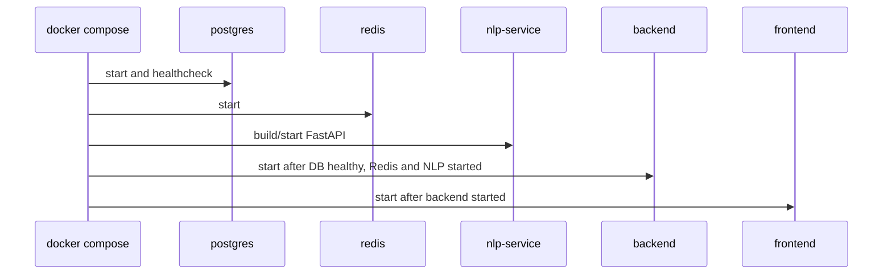
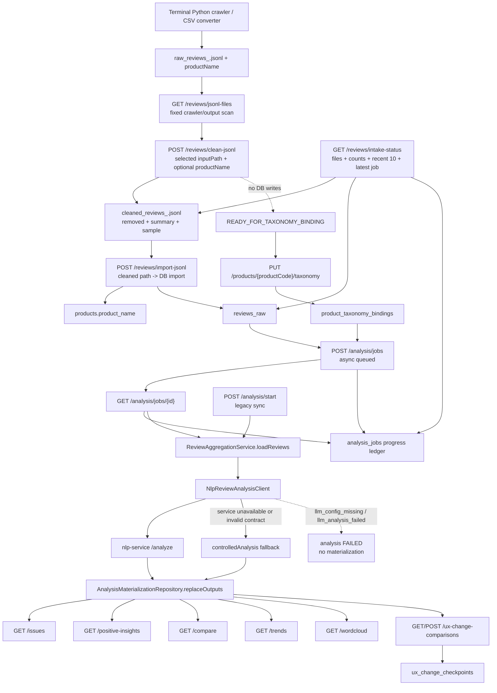
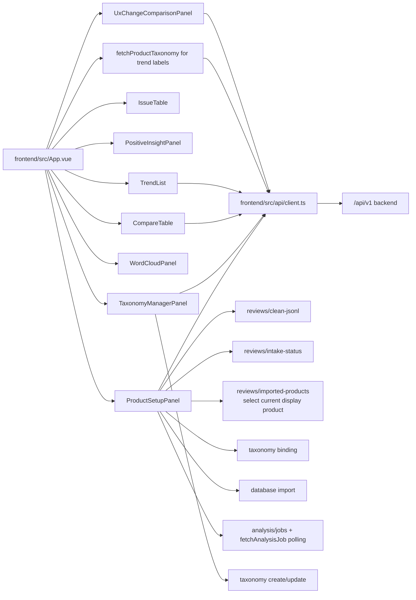

> generated_by: nexus-mapper v2
> verified_at: 2026-06-04
> provenance: AST-backed for Java/TypeScript/Python; runtime service dependencies inferred from docker-compose.yml and application.yml.

# Dependencies

## Runtime Dependency Graph

```mermaid
flowchart LR
  Browser["Browser / User"] --> Frontend["frontend: Vue + Vite"]
  Frontend -->|Axios /api/v1| Backend["backend: Spring Boot REST"]
  Browser -->|terminal command| Crawler["crawler: Python browser collector / CSV converter"]
  Crawler -->|writes| Jsonl["raw_reviews_<productCode>.jsonl + productName"]
  Frontend -->|GET /reviews/jsonl-files| Backend
  Frontend -->|POST /reviews/clean-jsonl| Backend
  Frontend -->|GET /reviews/intake-status| Backend
  Frontend -->|GET /reviews/imported-products| Backend
  Frontend -->|taxonomy binding + DB import| Backend
  Frontend -->|POST /analysis/jobs + GET /analysis/jobs/{id}| Backend
  Backend -->|discovers + reads + cleans| Jsonl
  Backend -->|Spring JDBC| Postgres["PostgreSQL"]
  Backend -->|HTTP /analyze| NLP["nlp-service: FastAPI"]
  Backend -. configured .-> Redis["Redis"]
  Backend -. optional .-> OneBound["OneBound external API"]
  NLP -->|LLM success / explicit rule mode| Backend
  NLP -. llm_config_missing .-> Backend
```

## Development Startup Order



## Backend Internal Flow



## Frontend Main Navigation Contract



The removed frontend main panels are `ActionList`, `ValidationList`, and `Showcase*`. Backend action/validation/showcase endpoints remain in code for compatibility and historical tests, but they are not current primary UI modules.

## Dependency Notes

- `frontend/src/api/client.ts` is the main frontend-to-backend contract file. It normalizes backend states like `success`, `empty`, `degraded`, `error`, `runtime-unavailable`, and handles timeout/error states. `resolveApiBaseURL` prefers explicit `VITE_API_BASE_URL`; when it is blank, the frontend derives `protocol//current-hostname:8080` from `window.location`, so opening the app through `localhost`, `127.0.0.1`, or a LAN host does not silently keep calling hardcoded `localhost`.
- Product setup now separates responsibilities: Python/CSV tooling writes raw JSONL outside the frontend; the backend scans fixed `crawler/output` via `GET /api/v1/reviews/jsonl-files`; the frontend lets the user select a candidate or manually fill a path and optional商品名称. `TaxonomyManagerPanel` is the standalone left-sidebar module for creating/editing saved taxonomy definitions. `ProductSetupPanel` uses four internal steps (`JSONL`, `taxonomy`, `导入分析`, `状态评论`) to reduce page crowding without adding a whole-page scrollbar; taxonomy selection now reads current active records through `GET /api/v1/taxonomies` and uses a taxonomy dropdown instead of a free-text product-category field; the `taxonomy` step uses readonly `UxTaxonomyTree` only for preview and a bind button, while UX label editing stays in the standalone taxonomy module. It also reads `GET /api/v1/reviews/imported-products` for database imported product history; selecting a history item emits `product-selected`, and `App.vue` switches the active `productCode` before refreshing issues, positive insights, trends, word cloud, compare primary input, and UX change primary product. The backend hides historical taxonomy versions from `/taxonomies`, keeps only one active default taxonomy candidate, and `GET /products/{productCode}/taxonomy` no longer writes a binding as a side effect. `POST /api/v1/reviews/clean-jsonl` 只清洗 raw JSONL and returns cleaned/removed/summary/sample plus handoff `READY_FOR_TAXONOMY_BINDING`，不写 `products`、`reviews_raw`、`sync_jobs` 或 `data_quality_runs`；`GET /api/v1/reviews/intake-status` is the persistent workflow ledger used after page refresh and after each step, returning raw/cleaned paths, file existence, summary, taxonomy binding status, imported/analyzed counts, downstream readiness, latest analysis job, and recent 10 reviews. 之后前端再引导 taxonomy 绑定；显式导入数据库时，只有 cleaned 文件实际存在才把 `cleanedOutputPath` 传给 `POST /api/v1/reviews/import-jsonl`，并带 `replaceExisting=true` 覆盖旧本地 JSONL 评论和旧物化输出。后端识别 `cleaned_reviews_*.jsonl` 时直接读取 cleaned 文件和同目录 summary 入库，不重复清洗 raw 文件；覆盖导入前会检查同商品是否有 `QUEUED`/`RUNNING` 分析任务，有则返回冲突，防止旧 `review_id` 被删除。启动 LLM 分析时，如果 `intake-status.importedReviewCount > 0`，前端复用现有入库评论并直接调用 `POST /api/v1/analysis/jobs`，不再为启动分析自动覆盖导入 cleaned JSONL。随后通过 `fetchAnalysisJob` 调用 `GET /api/v1/analysis/jobs/{id}` 轮询 `QUEUED/RUNNING/SUCCEEDED/FAILED`；进度优先来自 `analysis_jobs.total_review_count`、`processed_review_count`、`progress_percent`、`current_stage`，物化结果来自 `materialized_review_count`、`semantic_label_count`、`issue_cluster_count`、`downstream_ready`，并同步刷新 `intake-status`。后端每批 LLM 返回后会立即追加写入 review-level 物化结果，写入前校验 `review_id` 仍指向当前商品，并重建当前累计问题簇；前端只要看到下游物化 ready 或物化条数增长，就刷新 issues、positive insights、trends 和 word cloud，不再等全部批次结束；这些模块从旧空态/错误态重新进入时也会重新拉取接口。旧 `POST /api/v1/analysis/start` 保留同步执行；`POST /api/v1/crawl/jobs/{id}/import` remains for backend-created crawl jobs but is no longer the main frontend path.
- Current code search did not find a `/api/v1/demo-data/init` controller. Treat JSONL discovery/clean/import/analyze as the primary acceptance chain unless the demo-data endpoint is reintroduced.
- Product name display is separate from product lookup: backend queries still use `productCode`, while `ReviewImportService`, `ProductRepository`, compare responses and UX-change responses propagate `productName` so the frontend can show真实商品名 and keep `jd-...` only as a secondary code.
- UX labels are not decided by the frontend or crawler. The standalone `taxonomy` module edits and saves reusable UX label systems; the data intake page only selects an existing taxonomy from the taxonomy dropdown, previews it readonly, and binds it to the product. If the taxonomy API fails or returns no valid labels, the frontend shows an empty/error state instead of inventing fallback UX labels. Analysis uses the bound taxonomy as the allowed label set. `clean-jsonl` 的 handoff 明确要求先完成 taxonomy binding，再进入导入和分析阶段。
- Current trend flow no longer requests only the legacy default `battery` aspect. `App.vue` reads the product-bound taxonomy through `fetchProductTaxonomy`, filters enabled UX secondary labels, and calls `fetchTrends(productCode, inferredAspect, uxSecondaryLabel)` for each label. The backend still serves the existing `GET /api/v1/trends` endpoint; the key filter is `review_aspects.ux_secondary_label`, so generic labels outside the legacy aspect list can still appear as their own colored series in `TrendList`.
- Current word cloud flow keeps the existing `GET /api/v1/wordcloud` response contract, but backend selection is no longer pure full-text top-frequency extraction. `AnalysisMaterializationRepository.findWordCloudReviews` reads `review_aspects` and left-joins `review_semantic_labels`; `InsightQueryService.wordCloud` prefers `standardized_reason` and `evidence`, falls back to raw content, strips brand/model/object/template-field noise, and balances returned `WordCloudItem` rows across negative pain-point terms and positive认可 terms.
- Current compare flow calls `GET /api/v1/compare` with both `productCode` and `comparisonProductCode`. Backend requires both products to have materialized analysis output and checks taxonomy compatibility: the same bound `taxonomyId` passes immediately, and different IDs also pass when product category plus primary/secondary labels, enabled flags, synonyms, and descriptions are structurally equivalent. Incompatible taxonomies return `taxonomy-mismatch`.
- Current UX before/after flow uses `POST /api/v1/ux-change-comparisons`, `GET /api/v1/ux-change-comparisons`, and `GET /api/v1/ux-change-comparisons/{id}`. Backend stores only a checkpoint time and resolved windows in `ux_change_checkpoints`, then recomputes per-UX-secondary-label changes from `review_aspects` joined to `reviews_raw`.
- `backend/src/main/resources/application.yml` configures backend port, CORS origins/origin patterns, NLP base URL, NLP timeouts, and OneBound settings. `CorsProperties` and `WebConfig` allow explicit origins plus patterns for `localhost`, `127.0.0.1`, `::1`, and common LAN ranges, reducing frontend request failures caused by opening the UI from a different local host name. Real LLM analysis can exceed local-rule latency, so backend `NLP_READ_TIMEOUT` now defaults to `90s`; dev/prod compose pass `NLP_CONNECT_TIMEOUT` and `NLP_READ_TIMEOUT` through from `.env`.
- `backend/src/main/resources/application.yml` also configures `integration.crawler.base-url`, defaulting to `http://localhost:8010`.
- `docker-compose.yml` wires backend `NLP_BASE_URL` to `http://nlp-service:8000` and PostgreSQL JDBC to `postgres:5432`. It also bind-mounts `./crawler/output` into backend `/app/crawler/output` so Docker backend can discover/read host-generated raw JSONL and write cleaned JSONL. Both dev and prod compose files pass `OPENAI_*`/`LLM_*`, `NLP_FORCE_LOCAL`, and `NLP_ALLOW_LLM_FALLBACK` into `nlp-service`.
- `docker-compose.yml` does not currently start the Python crawler service; local JSONL crawl needs `python -m uvicorn crawler.service:app --host 127.0.0.1 --port 8010` or an equivalent process.
- `AnalysisJobService` depends on `NlpReviewAnalysisClient`, `DemoReviewAggregationService`, `AnalysisMaterializationRepository`, and `AnalysisJobRepository`. 异步任务启动后先清空该商品旧物化输出，再按 10 条一批调用 NLP；每批结果通过 `appendOutputs` 追加 `review_aspects` / `review_semantic_labels`，`appendOutputs` 会先确认该批 `review_id` 仍在 `reviews_raw` 且属于当前 `productCode`，再用累计已分析评论重建 `issue_clusters` / `issue_scores`。
- NLP service unavailability is still tolerated for MVP/demo fallback, but explicit LLM configuration/runtime errors from the NLP service such as `llm_config_missing` and `llm_analysis_failed` are fatal when `NLP_ALLOW_LLM_FALLBACK=false`: backend marks the analysis job `FAILED` and skips materialization so fake fallback data does not populate issues, selling points, trends or word cloud. For local acceptance runs, `.env` may set `NLP_ALLOW_LLM_FALLBACK=true`, meaning the NLP service tries the real OpenAI-compatible LLM first, then falls back to local rule analysis for external LLM rate-limit/connection/format failures.
- OneBound is optional second-track external sync. README and code indicate controlled demo data is still the first-track acceptance path.
- UX change default window preset is `ONE_MONTH`: one month before the checkpoint and one month after it. `TWO_WEEKS`, `THREE_MONTHS`, and `CUSTOM` day windows are also supported.

## Objected Boundary Checks

- Structure: the old `legacy/wh-source` archive was deleted on 2026-06-04. Current runtime modules are root `frontend/`, `backend/`, `nlp-service/`, `crawler/`, `pipeline/`, and `infra/`; `.tmp/` remains temporary output and should not be treated as a runtime module.
- Evolution: Git hotspots concentrate in frontend shell/API client/tests and backend smoke/integration tests, supporting the conclusion that API contract and demo acceptance path are the active development surface.
- Dependency: AST import graph did not expose internal imports due language/tooling limitations, so cross-service dependency direction is inferred from config files and manual code reading.
