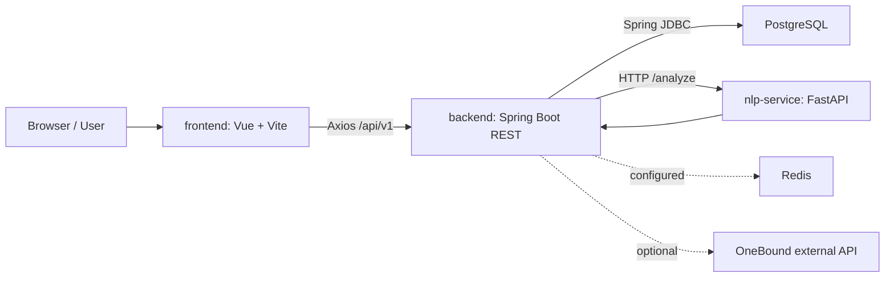
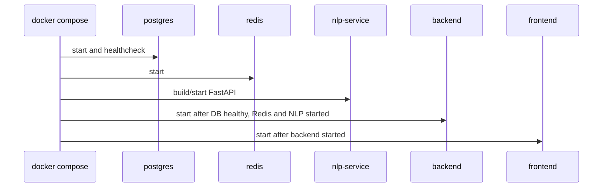
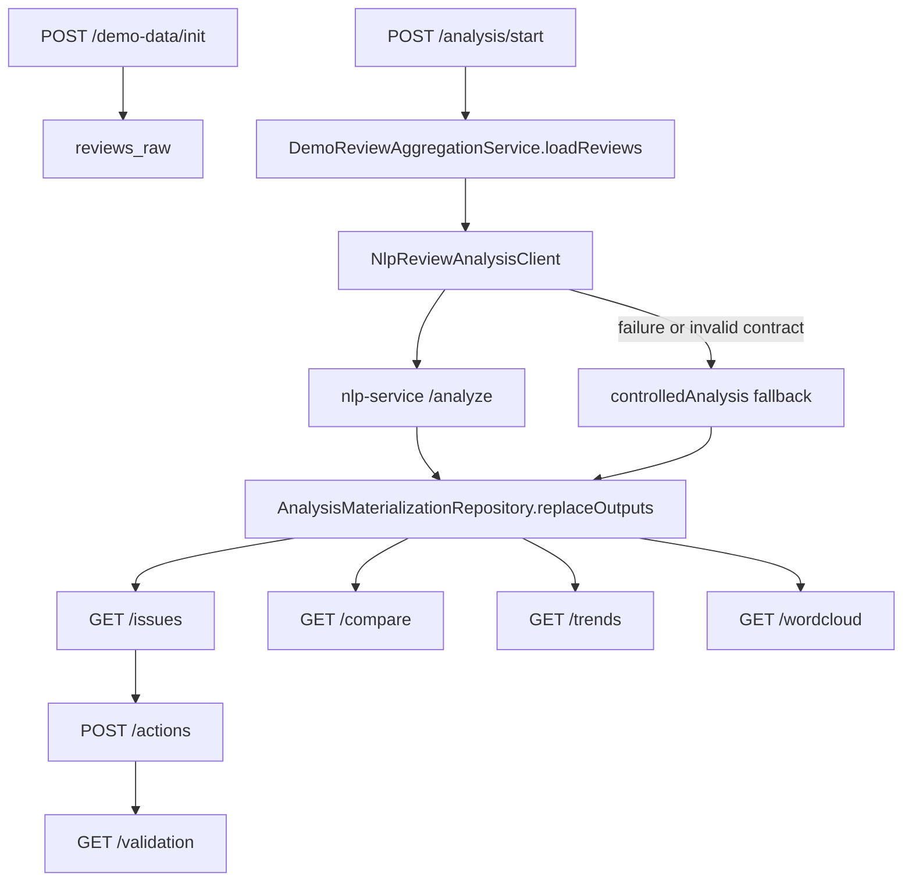

> generated_by: nexus-mapper v2
> verified_at: 2026-06-03
> provenance: AST-backed for Java/TypeScript/Python; runtime service dependencies inferred from docker-compose.yml and application.yml.

# Dependencies

## Runtime Dependency Graph

## Development Startup Order

## Backend Internal Flow

## Dependency Notes

- `frontend/src/api/client.ts` is the main frontend-to-backend contract file. It normalizes backend states like `success`, `empty`, `degraded`, `error`, `runtime-unavailable`, and handles timeout/error states.
- `backend/src/main/resources/application.yml` configures backend port, CORS origins, NLP base URL, NLP timeouts, and OneBound settings.
- `docker-compose.yml` wires backend `NLP_BASE_URL` to `http://nlp-service:8000` and PostgreSQL JDBC to `postgres:5432`.
- `AnalysisJobService` depends on `NlpReviewAnalysisClient`, `DemoReviewAggregationService`, `AnalysisMaterializationRepository`, and `AnalysisJobRepository`.
- NLP is optional for completion of analysis: backend can mark an analysis as `SUCCEEDED` with `degraded:*` errorMessage when NLP fails or returns invalid payload.
- OneBound is optional second-track external sync. README and code indicate controlled demo data is still the first-track acceptance path.

## Objected Boundary Checks

- Structure: `.tmp/`, `legacy/`, and `wh/` contain many files. They should not be treated as current runtime modules because README startup and Docker Compose use root `frontend/`, `backend/`, `nlp-service/`, and `infra/`.
- Evolution: Git hotspots concentrate in frontend shell/API client/tests and backend smoke/integration tests, supporting the conclusion that API contract and demo acceptance path are the active development surface.
- Dependency: AST import graph did not expose internal imports due language/tooling limitations, so cross-service dependency direction is inferred from config files and manual code reading.
