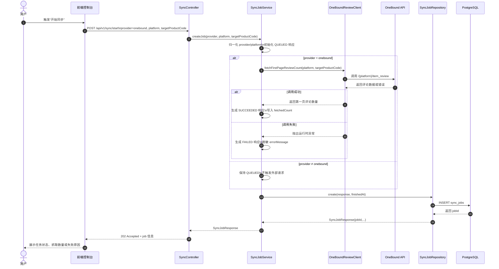
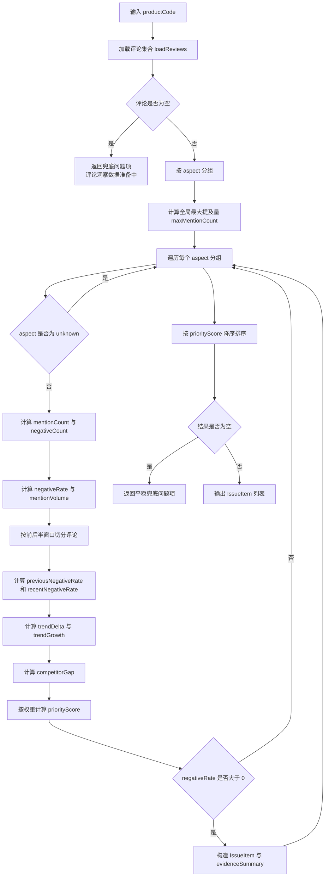

# 项目初始设计文档

本文以项目开始设计的视角描述当前仓库可确认的系统方案，并且只以仓库中的现有代码与文档为事实依据。文档重点覆盖两部分：系统用例时序图及说明、复杂功能算法设计及说明。

## 1. 设计目标

本项目面向“蓝牙耳机评论改进决策”场景，目标是在演示环境下形成一条可闭环的评论处理链路：

1. 前端提供统一看板入口；
2. 后端负责同步任务、演示数据、问题洞察、趋势、词云、动作与验证；
3. NLP 服务作为独立分析能力预留；
4. 数据最终回流到看板，支持问题识别与改进行动验证。

从当前仓库实现看，系统由 `frontend/`、`backend/`、`nlp-service/` 三个运行模块组成，开发环境通过 `docker-compose.yml` 启动，主入口分别为：

- 前端：`frontend/src/main.ts`
- 后端：`backend/src/main/java/com/wh/review/backend/BackendApplication.java`
- NLP 服务：`nlp-service/app/main.py`

## 2. 总体设计视角

### 2.1 角色与职责

- **用户**：在前端界面中登录、查看看板、触发同步或分析相关操作。
- **前端控制台**：负责交互、模块切换、接口调用和结果呈现，关键文件为 `frontend/src/App.vue` 与 `frontend/src/api/client.ts`。
- **后端 API**：负责统一业务入口，控制器位于 `backend/src/main/java/com/wh/review/backend/controller/`。
- **业务服务层**：负责同步、演示数据生成、评论聚合、问题计算等核心逻辑，关键文件包括 `SyncJobService.java`、`DemoDataInitializationService.java`、`DemoReviewAggregationService.java`、`InsightQueryService.java`。
- **数据库**：用于保存同步任务、产品、评论、动作等数据，初始化脚本位于 `infra/db/init/001_init.sql`。
- **外部评论源**：当前已接入的真实外部抓取路径为 OneBound，对应 `OneBoundReviewClient`。

### 2.2 主业务闭环

当前仓库已经体现出一条清晰的业务闭环：

1. 用户进入前端控制台；
2. 前端调用后端接口获取健康状态、问题列表、趋势和验证结果；
3. 如需真实评论来源，可由后端发起同步任务；
4. 后端将评论或演示评论组织成聚合视图；
5. `InsightQueryService` 对评论进行问题优先级、趋势、词云、验证等计算；
6. 前端将结果展示为看板，为后续动作登记与验证提供依据。

## 3. 系统用例的时序图及说明

### 3.1 选取的系统用例

本设计文档选择“**发起真实 OneBound 同步任务**”作为系统用例时序图，因为它最能体现系统内外部参与者之间的协作关系，并且对应的接口与服务链路已经在仓库中完整落地：

- 入口接口：`POST /api/v1/sync/start`
- 控制器：`SyncController.java`
- 核心服务：`SyncJobService.java`
- 外部调用：`OneBoundReviewClient.java`
- 持久化：`SyncJobRepository`

### 3.2 时序图（Mermaid）

图文件：`docs/requirements/diagrams/system-sync-sequence.mmd`



### 3.3 时序图说明

1. **前端只是请求发起者，不承载同步逻辑。** 真实同步发生在后端 `SyncJobService.createJob()` 中，前端只接收 `202 Accepted` 返回值。
2. **系统先建任务语义，再决定是否执行真实抓取。** 代码里先构造一个默认 `QUEUED` 的任务响应，再根据 `provider` 是否为 `onebound` 决定是否立即调用外部服务。
3. **只有 `provider=onebound` 才会触发真实外部调用。** 这是一个重要的业务分支，其他 provider 当前只会创建一个排队状态任务，不会抓取外部数据。
4. **真实外部调用只统计第一页评论数量。** 从现有代码看，`OneBoundReviewClient` 的目标是获取第一页评论条数，而不是将完整评论内容全部落库。
5. **失败场景不会直接把敏感信息透传给前端。** `SyncJobService.sanitizeError()` 会对 `key=` 和 `secret=` 参数进行脱敏，再作为 `errorMessage` 返回。
6. **任务结果最终会持久化。** 无论是 `QUEUED`、`SUCCEEDED` 还是 `FAILED`，都会经由 `SyncJobRepository.create(...)` 写入数据库，从而支持后续 `GET /api/v1/sync/jobs/{id}` 查询。

## 4. 复杂功能的算法设计

### 4.1 选取的复杂功能

本设计文档选择“**问题优先级评分算法**”作为复杂功能进行算法设计，因为它是当前仓库里最具业务判断性的核心逻辑，位于 `backend/src/main/java/com/wh/review/backend/service/InsightQueryService.java` 的 `listIssues()` 与 `buildIssueFactors()` 中。

该算法的目标是：

> 从某个商品的评论集合中识别出值得优先处理的问题维度，并为每个问题生成一个可排序的 `priorityScore`。

### 4.2 输入、输出与关键中间量

#### 输入

- `productCode`
- 该商品下的评论列表（来自 `DemoReviewAggregationService.loadReviews(productCode)`）

#### 输出

- `IssueItem[]`
- 每个 `IssueItem` 包含：`issueId`、`title`、`aspect`、`priorityScore`、`evidenceSummary`

#### 核心中间量

- `mentionCount`：某个问题维度的评论提及数
- `negativeCount`：负向评论数
- `negativeRate`：负向率
- `mentionVolume`：相对提及量
- `trendGrowth`：近期负向率相对前一时间窗口的增长值
- `competitorGap`：当前代码中的模拟竞品差距值
- `priorityScore`：四因子加权后的最终优先级分数

### 4.3 算法流程图（Mermaid）

图文件：`docs/requirements/diagrams/issue-priority-flow.mmd`



### 4.4 伪码表示

```text
function listIssues(productCode):
    normalizedProductCode = normalizeProductCode(productCode)
    reviews = loadReviews(normalizedProductCode)

    if reviews is empty:
        return [fallbackIssue("iss-demo-no-data")]

    groupedByAspect = group reviews by aspect
    maxMentionCount = max(size(group) for each group)
    result = []

    for each (aspect, aspectReviews) in groupedByAspect:
        if aspect == "unknown":
            continue

        mentionCount = size(aspectReviews)
        negativeCount = count(review.sentiment == NEGATIVE)
        negativeRate = negativeCount / mentionCount
        mentionVolume = mentionCount / maxMentionCount

        splitPoint = max(1, mentionCount / 2)
        previousWindow = aspectReviews[0:splitPoint]
        recentWindow = aspectReviews[splitPoint:mentionCount]
        if recentWindow is empty:
            recentWindow = previousWindow

        previousNegativeRate = computeNegativeRate(previousWindow)
        recentNegativeRate = computeNegativeRate(recentWindow)
        trendDelta = recentNegativeRate - previousNegativeRate
        trendGrowth = clamp01(max(0, trendDelta))

        competitorGap = clamp01(roundTo4(negativeRate * 0.7 + trendGrowth * 0.3))

        priorityScore = roundTo4(
            0.35 * negativeRate +
            0.25 * mentionVolume +
            0.20 * trendGrowth +
            0.20 * competitorGap
        )

        if negativeRate <= 0:
            continue

        result.add(buildIssueItem(aspect, priorityScore, mentionCount, negativeCount, trendDelta))

    if result is empty:
        return [fallbackIssue("iss-demo-empty")]

    sort result by priorityScore descending
    return result
```

### 4.5 算法设计说明

1. **先统一评论，再做问题计算。** `listIssues()` 并不直接访问数据库，而是依赖 `DemoReviewAggregationService.loadReviews()` 返回已带有 `aspect` 和 `sentiment` 的聚合评论对象。
2. **算法的核心是“四因子加权”。** 当前权重写死在代码中：负向率 `0.35`、提及量 `0.25`、趋势增长 `0.20`、竞品差距 `0.20`。
3. **提及量使用相对归一化值。** 不是直接用原始评论数，而是用“当前维度提及量 / 最大提及量”，让不同维度可以在同一量纲上比较。
4. **趋势增长采用前后窗口对比。** 代码将某个维度的评论序列按前后两半切分，用后半段负向率减去前半段负向率，来判断问题是否在恶化。
5. **只放大变差，不奖励变好。** `trendGrowth = clamp01(max(0, trendDelta))` 表明如果近期情况改善，趋势项不会给负分，只是记作 0。
6. **竞品差距目前是一个业务近似值。** 当前实现没有真正查询竞品库，而是用 `negativeRate` 和 `trendGrowth` 组合出一个模拟差距分值，因此它更像“相对风险信号”，不是严格意义上的真实竞品对比结果。
7. **只输出真正存在负向风险的问题。** 当某个维度 `negativeRate <= 0` 时，不会被加入问题列表。
8. **异常和空数据都有兜底返回。** 这保证前端问题列表在数据不足或聚合失败时仍然能展示可解释结果，而不是直接报错。

## 5. Mermaid CLI 产图方式

当前文档中的两张图已经分别保存为独立的 `.mmd` 文件，便于后续用 Mermaid CLI 渲染：

- `docs/requirements/diagrams/system-sync-sequence.mmd`
- `docs/requirements/diagrams/issue-priority-flow.mmd`

可在仓库根目录执行以下命令生成 SVG：

```bash
npx @mermaid-js/mermaid-cli -i docs/requirements/diagrams/system-sync-sequence.mmd -o docs/requirements/diagrams/system-sync-sequence.svg
npx @mermaid-js/mermaid-cli -i docs/requirements/diagrams/issue-priority-flow.mmd -o docs/requirements/diagrams/issue-priority-flow.svg
```

如果需要导出 PNG，只需把输出文件后缀改为 `.png`。

## 6. 结论

从项目开始设计的角度看，这个仓库已经具备一个清晰的演示型评论决策系统骨架：

- 在系统层面，已形成“前端入口 + 后端业务服务 + 外部评论源 + 数据库存储”的标准结构；
- 在业务链路层面，真实同步链路与问题洞察链路都已经具备可落图、可说明、可扩展的设计基础；
- 在算法层面，问题优先级评分已经体现出多因子排序思想，适合作为后续升级为真实生产算法的起点。

后续如果要继续深化设计，最值得扩展的方向包括：真实竞品对比数据接入、NLP 服务与后端分析任务的真正联动、以及同步结果向洞察数据层的自动流转。
